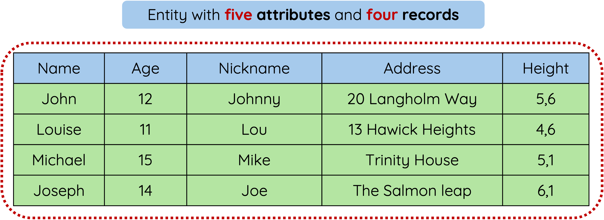
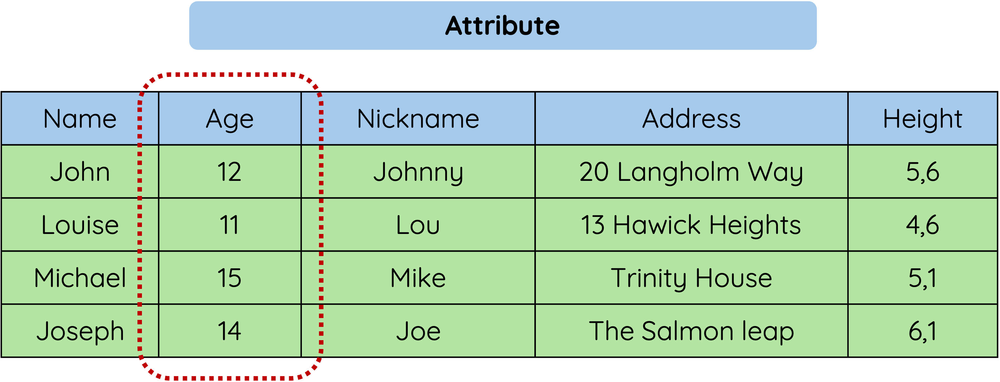
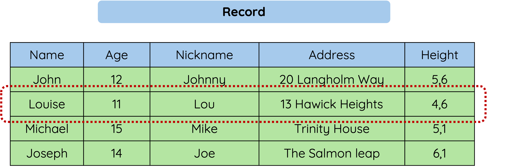

# Entities and Attributes

## Explanation

A database can have more than one table. 

When we we are working with more than one table it is called an Entity and Entities are made up of Attributes and Records.

<figure markdown="span">
{ width="550" }
<figcaption></figcaption>
</figure>

### Attributes

An Attribute holds one piece of data at a time - e.g. a person’s name, age or phone number.

<figure markdown="span">
  { width="550" }
  <figcaption></figcaption>
</figure>

### Records

A record holds a complete set of data.

<figure markdown="span">
  { width="550" }
  <figcaption></figcaption>
</figure>

