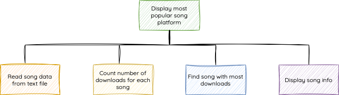

# Modular Programming

For Higher, your programs will be broken down into modules. These are smaller chunks of program that do a particular thing. 

The program has a main algorithm and lots of modules (also called sub-programs). Modules are generally self-contained. Data can be passed into them and back out, this is called the `data flow`.

==Each step in the algorithm is usually broken down into a module.==

Consider the following structure diagram for a program to find and display the most-downloaded song on an online streaming platform:

<figure markdown="span">
  { width="650" }
  <figcaption></figcaption>
</figure>
 
The main steps of the algorithm are laid out and each step could be implemented as a module.

Data from one step could flow in or out (`this is called the data flow`) and would be passed to the next module.

Modular programming is useful because it allows different programmers to work on each module and further supports an agile approach to development as the task is broken down into smaller chunks that can be developed and tested independently before the modules are tested as a wwhole program.

!!! note

    When we write modules, it’s a good idea to use local variables due to a local variable being a variable that can only used inside one module and cant be changed by other parts of the program and thus, helps prevent mistakes.
