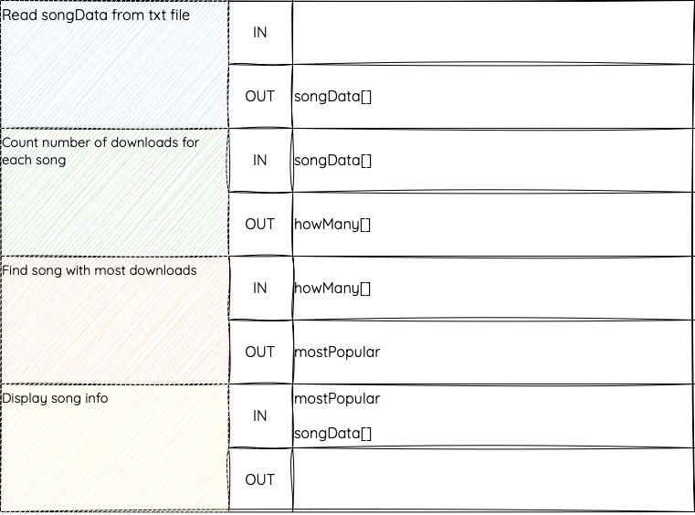

# Data Flow In / Out

When data is passed between modules, this is called the data flow.

There are two ways of indicating data flow - either in a table, or as arrows on a structure diagram. The data flow design tells you (directly) which parameters you will need when implementing.

The data flow can be variables or arrays. This data is passed in or passed out of a module.

You can think of data flow like inputs and outputs from the analysis stage: what does each module need to know?

The structure diagram on the previous page had four modules:

1. Read song data from text file

2. Count number of downloads for each song
   
3. Find song with most downloads [`the position of the most popular song in the list`]
   
4. Display info of song with the most downloads

Data will have to be passed between these modules:

* The song data will need to be passed from module 1 to module 2.
  
* How many times a song has been downloaded will need to go from module 2 to module 3
  
* Which song ID, and the details of all songs, will need to go to module 4 (`So that it can display the details matching the most popular song`)

We can note the data flow on the structure diagram:

<figure markdown="span">
  { width="650" }
  <figcaption></figcaption>
</figure>

Arrows that point up are `IN`, arrows that point down are `OUT`. 

You will often be given this part of the design, as it helps you to decide which parameters are needed in your modules.

!!! warning "The Rules of Data Flow"

    * Input from the user is not data flow. It’s only data flow if it’s being passed to/from another module
    * Reading from (or writing to) a file is not data flow. The data can be read from a file (not data flow) but then passed out to another module (this is data flow)

==Note==: We can represent the same information in a table.

<figure markdown="span">
  { width="650" }
  <figcaption></figcaption>
</figure>

`Songdata[]` and `howmany[]` are going to be arrays (multiple pieces of data, not a single value), so brackets have been added, whereas mostpopular is a variable (one piece of data).

You will notice that the first module is reading from a file. 

==Remember, File input is not counted as data flow going in.== 

The data flow on the diagram only shows data that is being passed as a parameter.

