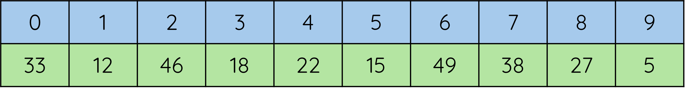

# Finding Minimum and Maximum

!!! info "What you need to know"

	You must be able to describe, exemplify and implement arrays of records 

## Explanation

The find minimum (find-min) and find maximum (find-max) algorithms are very similar, only differing in whether they use the < or > sign. 

These algorithms would only work on arrays of integers or real numbers (you can’t find the “maximum name” from an array of strings).

For example, below is an array of 10 integers:

<figure markdown="span">
  { width="800" }
</figure>

To find the maximum (highest) value, we would look through the list one-by-one:

* The first value is 33. We don’t yet know any other values, so 33 must be the highest we’ve found.
  
* The next value is 12. That is less than 33, so we ignore it (it isn’t higher).
  
* The next value is 46. This is higher than 33 (the highest we’ve found so far), so becomes the new highest.
  
* The next value is 18. This is lower than 46 (the current highest found), so we ignore it…

__On that basis, we would find that 49 (element 6) is the highest value in the array.__

=== "__Find Maximum Algorithm__"

    ``` pseudocode linenums="1"
	Declare a maximum variable, and set it to the first item in the array (e.g. 33)
	
	Loop for each element in the array

		If number(counter) > maximum

			Set maximum to number(counter)
 
		End if

	End for loop
    ```

	
=== "__Find Minimum Algorithm__"

    ``` pseudocode linenums="1"
	Declare a minimum variable, and set it to the first item in the array (e.g. 33)
	
	Loop for each element in the array

		If number(counter) < maximum

			Set minimum to number(counter)
 
		End if

	End for loop
    ```

